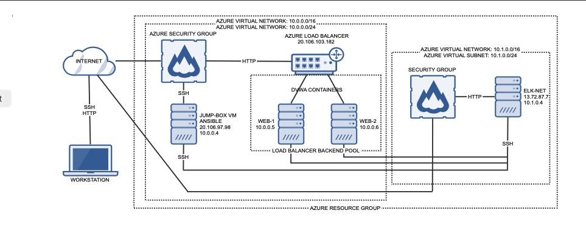

## Automated ELK Stack Deployment

The files in this repository were used to configure the network depicted below.

These files have been tested and used to generate a live ELK deployment on Azure. They can be used to either recreate the entire deployment pictured above. Alternatively, select portions of the .yml file may be used to install only certain pieces of it, such as Filebeat.

# [elk-playbook.yml](ansible/elk-playbook.yml) 

This document contains the following details:
- Description of the Topology
- Access Policies
- ELK Configuration
  - Beats in Use
  - Machines Being Monitored
- How to Use the Ansible Build

### Description of the Topology

The main purpose of this network is to expose a load-balanced and monitored instance of DVWA, the D*mn Vulnerable Web Application.

Load balancing ensures that the application will be highly available, in addition to restricting access to the network.
- What aspect of security do load balancers protect? 
    Load balancers help protect the good network traffic from the bad network traffic. They increase application availability, responsivenes and prevent server overload. 

- What is the advantage of a jump box?
    The advantage is the jump-box provides a secured access point to the web servers and prevents public acccess. 

Integrating an ELK server allows users to easily monitor the vulnerable VMs for changes to the configuration and system files.
- What does Filebeat watch for? 
    Log files or Log events

- What does Metricbeat record? 
    Metricbeat records metrics and statistics from the sytstem and services running on the server.

| Name     | Function  | IP Address | Operating System |
|----------|-----------|------------|------------------|
| Jump Box | Gateway   | 10.0.0.1   | Linux            |
| WEB-1    | Webserver | 10.0.0.5   | Linux            |
| WEB-2    | Webserver | 10.0.0.6   | Linux            |
| ELK-NET  | Monitoring| 10.1.0.4   | Linux            |

### Access Policies

The machines on the internal network are not exposed to the public Internet. 

Only the Jump Box machine can accept connections from the Internet. Access to this machine is only allowed from the following IP addresses:
- 20.106.97.78

Machines within the network can only be accessed by the jump-box.
- Which machine did you allow to access your ELK VM? What was its IP address? 20.106.97.78

A summary of the access policies in place can be found in the table below.

| Name     | Publicly Accessible | Allowed IP Addresses |
|----------|---------------------|----------------------|
| Jump Box | Yes                 | 10.0.0.1 10.0.0.2    |
| Web-1    | No                  | 20.106.97.78         |
| Web-2    | No                  | 20.106.97.78         |
| ELK-NET  | Yes (http)          | 20.106.97.78         |

### Elk Configuration

Ansible was used to automate configuration of the ELK machine. No configuration was performed manually, which is advantageous because...
- What is the main advantage of automating configuration with Ansible? 
    The main advantage is being able to make changes with any of the VM's in the network. 

The playbook implements the following tasks:
- Install Docker.io
- Install python3-pip
- Install Docker Python module
- Download and launch a Docker web container. 

The following screenshot displays the result of running `docker ps` after successfully configuring the ELK instance.

### Target Machines & Beats
This ELK server is configured to monitor the following machines:
- List the IP addresses of the machines you are monitoring
    10.0.0.4 10.0.0.5 10.0.0.6 10.1.0.4

We have installed the following Beats on these machines:
- Specify which Beats you successfully installed
    Metricbeat & Filebeat

These Beats allow us to collect the following information from each machine:
- Filebeat monitors Log files or Log events and forwards them to either Elasticsearch or Logstash for indexing.  Metricbeat helps you monitor the integrity of your file system in your server through metrics and stats.

### Using the Playbook
In order to use the playbook, you will need to have an Ansible control node already configured. Assuming you have such a control node provisioned: 

SSH into the control node and follow the steps below:
- Copy the ansible configuration file to run the playbook.
- Update the ansible host file to include...
- Run the playbook, and navigate to the Jumpbox to check that the installation worked as expected.

- Which file is the playbook? elk-playbook.yml 
- Where do you copy it? filebeat-playbook.yml to /etc/ansible/roles
- Which file do you update to make Ansible run the playbook on a specific machine? elk-playbook.yml 
- How do I specify which machine to install the ELK server on vs which to install Filebeat on? Specify the servers IP. 
- _Which URL do you navigate to in order to check that the ELK server is running? http://[ELK-VM-IP]:5601/app/kibana

_As a **Bonus**, provide the specific commands the user will need to run to download the playbook, update the files, etc._